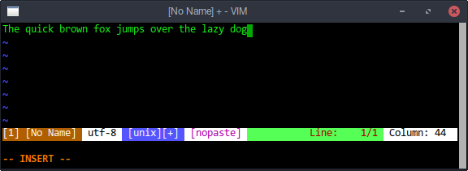

# dotfiles

Collection of @lzutao dotfiles.

Currently only tested for Debian-based and Arch-based distro.

## General Information

| Shell      | WM / DE | Editor     | Terminal      | Multiplexer | Compositor | Audio      | Monitor | Mail | IRC |
| ---------- | ------- | ---------- | ------------- | ----------- | ---------- | ---------- | ------- | ---- | --- |
| bash / zsh | XFCE    | Vim / Subl | xfce4 / urxvt | tmux        | compton    | pulseaudio | custom  |      |     |

### tmux

Try to be compatible with tmux 1.8 and 2.3+. Use <kbd>Alt</kbd><kbd>A</kbd> as prefix key.

### zsh

Manual configuration (no dependencies).

**Preview**:




### subl

**Keymap**: View this [config](subl/.config/sublime-text-3/Packages/User/Default%20%28Linux%29.sublime-keymap).

**Installed package**: View this [config](subl/.config/sublime-text-3/Packages/User/Package%20Control.sublime-settings).

**Custom syntax**: bash, c, c++, css, html, java, js, makefile, python, xml.

### Firefox

Install tweak by:

```bash
sh ./scripts/tweak_firefox.sh
```

## Getting Started

These instructions will get you a copy of the project up and running on
your local machine.

### Prerequisites

GNU Stow is needed for installing this dotfiles, to install `stow`, use
the following command in proper distribution.

| Distro            | Command                          |
| ----------------- | -------------------------------- |
| Debian and Ubuntu | `sudo apt-get install stow`      |
| Arch Linux        | `sudo pacman -Syu --needed stow` |

### Installation

Install with backup in `dotfiles/.backup`:

```bash
cd ~
git clone https://github.com/lzutao/dotfiles.git
cd dotfiles
./install.sh -b
```

Or without backup:

```bash
./install.sh
```

Now configure git:

```bash
git config --global user.name "username"
git config --global user.email "example@email.com"
```

[Telling Git about your signing key][git_gpg] if you have one.

[git_gpg]: https://help.github.com/articles/telling-git-about-your-signing-key/

### Post-installation

* User should use `stow --restow <folder>` to update properly.

* User should **log out** and log in again to use Gnome Keyring Daemon.

  **Rationale**: This repo contains `~/.profile` file.

## Known Issues

* `fontconfig` may cause noised font rendering on [Fedora](https://getfedora.org).

### amdgpu - Radeon HD 8790M causes crash when resuming with kernel 4.18+

#### Temporary fix

Disable the `radeon` and `amdgpu` in file `/etc/modprobe.d/blacklist.conf`.

```bash
% sudo tee -a /etc/modprobe.d/blacklist.conf << EOF
blacklist amdgpu
blacklist radeon
EOF
% sudo update-initramfs -u -v
```

#### Tried methods (Wrong ones):

* Disable `dmp` (Dynamic Power Management):
  * Add `amdgpu.dpm=0` or `radeon.dpm=0` to `GRUB_CMDLINE_LINUX_DEFAULT` in `/etc/default/grub`.
  * Then run: `sudo update-grub`.

## Contributing

Please read CONTRIBUTING.rst for details on our code
of conduct, and the process for submitting pull requests to us.

## Thanks To

All other dotfiles that I stole from. I give references in the comment
of many files. But I am too lazy to list all here.

See also the list of [contributors] who participated in this project.

[contributors]: https://github.com/lzutao/dotfiles/graphs/contributors

## License

This project is licensed under the MIT License - see the LICENSE file for details.
