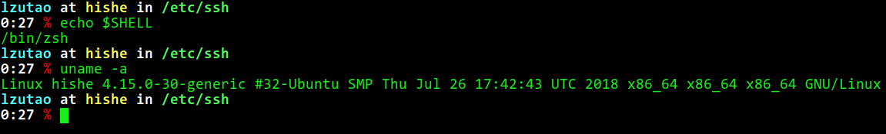

dotfiles
========

Collection of @lzutao dotfiles :lollipop: :sparkles: :gift:

.. contents:: **Table of Contents**
   :depth: 2

Disclaimer
----------

- I do not take any responsibility for any data loss caused by this
  **dotfiles** repo.
- Please do NOT link any file in ``~/.ssh/`` or ``~/.gnupg`` to this
  dotfiles for the sake of information security.
- If you want to backup your secret dotfiles:

  * Create a private repository called ``secret_dotfiles`` instead.
  * Try `Gitlab`_ for free private repo.
  * I would recommend having passphrases to protect all your keys.

- Currently only tested for Debian-based and Arch-based distro.

General Information
-------------------

+------------+---------+------------+------------------+-------------+------------+------------+---------+------+-----+
| Shell      | WM / DE | Editor     | Terminal         | Multiplexer | Compositor | Audio      | Monitor | Mail | IRC |
+============+=========+============+==================+=============+============+============+=========+======+=====+
| bash / zsh | XFCE    | VIM / Subl | terminal / urxvt |             | compton    | pulseaudio | custom  |      |     |
+------------+---------+------------+------------------+-------------+------------+------------+---------+------+-----+

zsh
~~~

Manual configuration (no dependencies), not full feature but at least
good enough.

**Preview**:

|preview|

subl
~~~~

**Keymap**:

+------------------------------+-------------------+
| Shortcut                     | Bindings          |
+==============================+===================+
| :kbd:`Ctrl+K`, :kbd:`Ctrl+P` | Title case        |
+------------------------------+-------------------+
| :kbd:`Ctrl+0`                | Reset font size   |
+------------------------------+-------------------+

**Installed package**: If installed Package Control in SublimeText, it
will install the following packages:

-  Autotools
-  CMake
-  INI
-  Markdown Table Formatter
-  MasmAssembly
-  Meson
-  NASM x86 Assembly

**Custom syntax**: bash, c, c++, css, html, java, js, makefile, python, xml.

Firefox
~~~~~~~

Install tweak by:

.. code:: bash

    bash ./scripts/tweak_firefox.sh

Getting Started
---------------

These instructions will get you a copy of the project up and running on
your local machine.

Prerequisites
~~~~~~~~~~~~~

GNU Stow is needed for installing this dotfiles,
to install ``stow``,
use the following command in proper distribution.

+---------------------+--------------------------------------+
| Distro              | Command                              |
+=====================+======================================+
| Debian and Ubuntu   | ``sudo apt-get install stow``        |
+---------------------+--------------------------------------+
| Arch Linux          | ``sudo pacman -Syu --needed stow``   |
+---------------------+--------------------------------------+

Installation
~~~~~~~~~~~~

Install with backup in ``dotfiles/.backup``:

.. code:: bash

    cd ~
    git clone https://github.com/lzutao/dotfiles.git
    cd dotfiles
    ./install.sh -b

Or without backup:

.. code:: bash

    ./install.sh

Now configure git:

.. code:: bash

    git config --global user.name "username"
    git config --global user.email "example@email.com"

`Tell git about your GPG key`_ if you have one.

Known Issues
------------

-  ``fontconfig`` may cause noised font rendering on `Fedora`_.

Contributing
------------

Please read `<CONTRIBUTING.rst>`__ for details on our code of conduct,
and the process for submitting pull requests to us.

Thanks To
---------

All other dotfiles that I stole from.
I give references in the comment of many files.
But I am too lazy to list all here.

See also the list of `contributors`_ who participated in this project.

License
-------

This project is licensed under the MIT License - see the `<LICENSE>`__ file for details

.. _Gitlab: https://gitlab.com
.. _contributors: https://github.com/lzutao/dotfiles/graphs/contributors
.. _Tell git about your GPG key: https://help.github.com/articles/telling-git-about-your-gpg-key/
.. _Fedora: https://getfedora.org
.. _compton: https://wiki.archlinux.org/index.php/Compton

