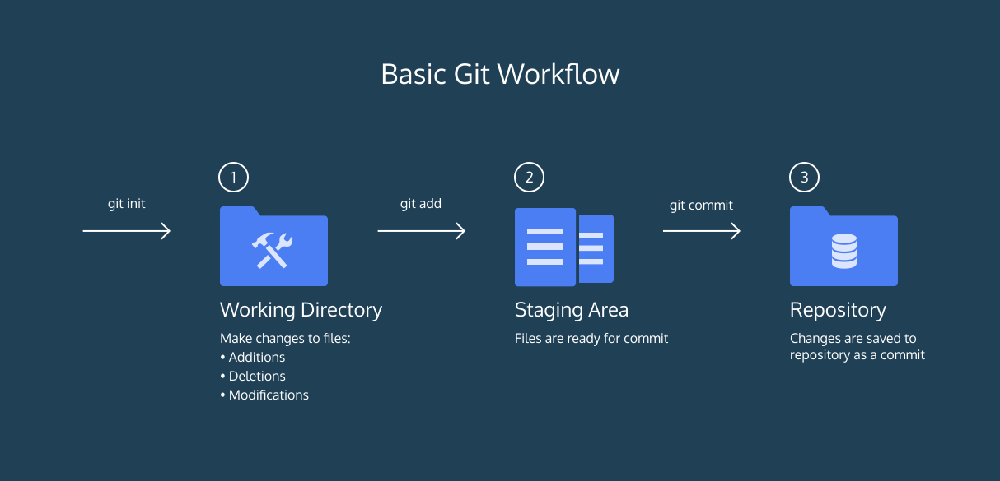
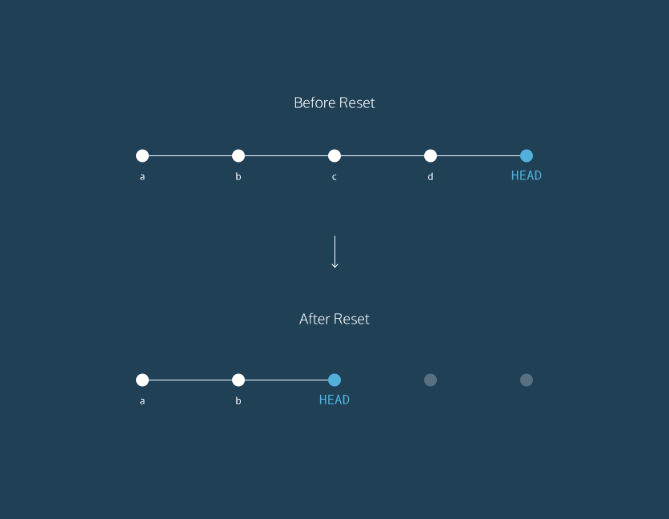
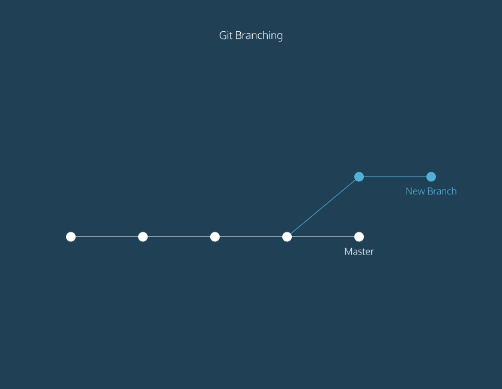

# Using Git

## Global Settings

Interactive Beginners Tutorial: http://try.github.io/

## Setup

See where Git is located: `which git`

Get the version of Git: `git --version`

## Help

Help: `git help`

## Git Workflow



A Git project can be thought of as having three parts:

1. A *Working Directory*: where you'll be doing all the work: creating, editing, deleting and organizing files
1. A *Staging Area*: where you'll list changes you make to the working directory
1. A *Repository*: where Git permanently stores those changes as different versions of the project

The Git workflow consists of editing files in the working directory, adding files
to the staging area, and saving changes to a Git repository. In Git, we save changes with a commit.

## Configure tooling

Configure user information for all local repositories

`git config --global user.name "[name]"`: Sets the name you want attached to your commit transactions

`git config --global user.email "[email address]"`: Sets the email you want attached to your commit transactions

## Create repositories

Start a new repository or obtain one from an existing URL

`git init [project-name]`: Creates a new local repository with the specified name

`git clone [url]`: Downloads a project and its entire version history

## Make changes
Review edits and craft a commit transaction

`git status`: inspects the contents of the working directory and staging area

`git add`: adds files from the working directory to the staging area

`git diff`: shows the difference between the working directory and the staging area

`git diff --staged`: Shows file differences between staging and the last file version

`git commit`: permanently stores file changes from the staging area in the repository

`git log`: Lists version history for the current branch

`git log --follow [file]`: Lists version history for the file, including renames

`git diff [first-branch]...[second-branch]`: Shows content differences between two branches

`git show [commit]`: Outputs metadata and content changes of the specified commit

## Reset

In Git, the commit you are currently on is known as the `HEAD` commit.

Each circle represents a commit:


**Before reset**:
- `HEAD` is at the *most recent commit*

**After resetting**:
- `HEAD` goes to a *previously made commit* of your choice
- The gray commits are no longer part of your project
- You have in essence rewound the project's history

`git show HEAD`: To see the `HEAD` commit, enter:

`git checkout HEAD filename`: Discards changes in the working directory.

`git checkout -- filename`: `--` simply promising the command line that
there are no more options after it. This way if you happen to have a
branch named `octocat.txt`, it will still revert the file, instead of
switching to the branch of the same name.

`git reset filename` or `git reset HEAD filename`: Unstages the file, but preserves its contents

`git reset commit_SHA`: Undoes all commits after [commit], preserving changes locally.
`HEAD` is now set to that previous commit `commit_SHA`.

`git reset --hard [commit]`: Discards all history and changes back to the specified commit

`git rm [file]`: Deletes the file from the working directory and stages the deletion

`git rm --cached [file]`: Removes the file from version control but preserves the file locally

`git mv [file-original] [file-renamed]`: Changes the file name and prepare it for commit

## Save fragments

Shelve and restore incomplete changes

`git stash`: Temporarily stores all modified tracked files

`git stash pop`: Restores the most recently stashed files

`git stash list`: Lists all stashed changesets

`git stash drop`: Discards the most recently stashed changeset

## Branching
Git *branching* allows users to experiment with different versions
of a project by checking out separate branches to work on.

`git branch`: Lists all local branches in the current repository

The diagram illustrates branching.



- The circles are commits, and together form the Git project's commit history.
- *New Branch* is a different version of the Git project. It contains commits
from *Master* but also has commits that Master does not have.

`git branch new_branch`: Creates a new branch.

`git checkout branch_name`: Switches to the specified branch and updates working directory

`git checkout master; git merge branch_name`: Combines the specified branch’s history into the current branch

> The merge is a `"fast forward"` if Git recognizes that branch contains the most recent commit.
Git *fast forwards* master to be up to date with branch.

`git branch -d branch_name`: delete the specified branch

## Merge conflict

The merge is successful if `master` had not changed since we made a commit on `branch_name`.

Let's say you decide you'd like to merge the changes from `branch_name` into `master`.

If you've made commits on separate branches that alter the same line in conflicting ways.
Now, when you try to merge `branch_name` into `master`, Git will not know which version of the file to keep.

- Switch to the `master` branch.
- From the terminal, enter the command below:
```
git merge branch_name
```

This will try to merge `branch_name` into `master`.

In the output, notice the lines:
```
CONFLICT (content): Merge conflict in conflict_file.txt
Automatic merge failed; fix conflicts and then commit the result.
```
- We must fix the merge conflict.

In the code editor, look at `conflict_file.txt`. Git uses markings to indicate the `HEAD` (master) version of the file and the `branch_name` version of the file, like this:
```diff
<<<<<<< HEAD
master version of line
=======
branch_name version of line
>>>>>>> branch_name
```

Git asks us which version of the file to keep:
the version on `master` or the version on `branch_name`.
You decide you want the `branch_name` version.

So, from the code editor, delete the content of the line as it appears in the `master` branch

Delete all of Git's special markings including the words `HEAD` and `branch_name`.
If any of Git's markings remain, for example, `>>>>>>>` and `=======`, the conflict remains.

- Add `conflict_file.txt` to the staging area.
- Make a commit. For your commit message like "Resolve merge conflict" to indicate the purpose of the commit.

### NOTE

After you finish with all branches in a particular module, you may want to run:

```bash
git gc --prune=now
```

This will remove all the dangling commits, trees, and blobs left over from the probably-large number of mismatched objects discarded when you deleted tmpbranch.

## Teamwork

- `git clone remote_location clone_name`

In this command:
1. `remote_location` tells Git where to go to find the remote. This could be a web address, or a filepath, such as:
2. `clone_name` is the name you give to the directory in which Git will clone the repository.

One thing that Git does behind the scenes when you clone **remote_location**
is give the remote address the name *origin*, so that you can refer to it more conveniently.

- `git remote -v`: see a list of a Git project's remotes

- `git fetch`: This command will not *merge* changes from the remote into your
local repository. It brings those changes onto `origin/master` branch

- `git merge origin/master`: integrate `origin/master` into your local `master` branch

- `git push origin your_branch_name`: push your branch up to the remote, `origin`

- `git stash` to stash your changes

- `git stash apply` to re-apply your changes after your pull.

- `git pull`: Downloads bookmark history and incorporates changes

